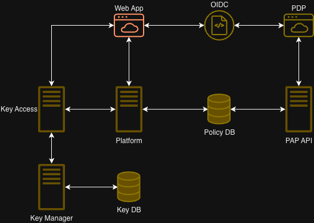

# Stratium Platform Documentation

Welcome to the Stratium Platform documentation. This guide will help you get started with creating policies, managing entitlements, and integrating the platform with your existing systems.

## Table of Contents

### Policy Management
- [JSON Policy Creation](../policies/JSON_POLICIES.md)
- [OPA Policy Creation](../policies/OPA_POLICIES.md)
- [XACML Policy Creation](../policies/XACML_POLICIES.md)
- [Policy Best Practices](../policies/BEST_PRACTICES.md)

### Entitlement Management
- [Creating Entitlements](../entitlements/CREATING_ENTITLEMENTS.md)
- [Entitlement Examples](../entitlements/EXAMPLES.md)

### Integration Guides
- [OIDC Integration](../integration/OIDC_INTEGRATION.md)
- [Database Integration](../integration/DATABASE_INTEGRATION.md)
- [Secrets Manager Integration](../integration/SECRETS_MANAGER.md)
- [Key Manager Integration](../integration/KEY_MANAGER.md)

### Sample Applications
- [Building a Golang Client](../samples/GOLANG_CLIENT_SAMPLE.md) - Step-by-step guide to building a ZTDF encryption client

## Quick Start

### 1. Create Your First Policy

The easiest way to get started is with an OPA policy:

```json
{
  "name": "My First Policy",
  "effect": "allow",
  "language": "opa",
  "policy_content": {
    "rego": "package stratium.authz\n\ndefault allow = false\n\nallow {\n    input.subject.department == \"engineering\"\n    input.resource.owner == \"engineering\"\n}"
  }
}
```

See the [OPA Policy Guide](./policies/OPA_POLICIES.md) for more details

### 2. Set Up Authentication

Configure OIDC authentication to integrate with your identity provider:

```yaml
oidc:
  issuer: "https://your-idp.com"
  client_id: "your-client-id"
  client_secret: "your-client-secret"
```

See the [OIDC Integration Guide](./integration/OIDC_INTEGRATION.md) for complete setup instructions.

### 3. Create Entitlements

Grant users access to resources based on their attributes:

```json
{
  "name": "Engineering Database Access",
  "subject_attributes": {
    "department": "engineering"
  },
  "resource_attributes": {
    "resource_type": "database"
  },
  "actions": ["read", "write"]
}
```

See the [Entitlement Guide](./entitlements/CREATING_ENTITLEMENTS.md) for more examples.

## Architecture Overview



## Informational Links

### Zero Trust Architecture
- [NIST SP 800-207: Zero Trust Architecture](https://nvlpubs.nist.gov/nistpubs/SpecialPublications/NIST.SP.800-207.pdf) - Comprehensive guide to Zero Trust principles and implementation
- [CISA Zero Trust Maturity Model](https://www.cisa.gov/zero-trust-maturity-model) - Framework for implementing Zero Trust
- [NSA Zero Trust Security Model](https://media.defense.gov/2021/Feb/25/2002588479/-1/-1/0/CSI_EMBRACING_ZT_SECURITY_MODEL_UOO115131-21.PDF) - Zero Trust guidance from NSA

### Trusted Data Format (TDF)
- [OpenTDF Project](https://opentdf.io) - Open source Trusted Data Format specification and implementation
- [OpenTDF Documentation](https://opentdf.io/introduction) - Technical documentation for TDF architecture
- [OpenTDF GitHub](https://github.com/opentdf) - Open source TDF libraries and tools

### Attribute-Based Access Control (ABAC)
- [NIST SP 800-162: Guide to ABAC](https://nvlpubs.nist.gov/nistpubs/SpecialPublications/NIST.SP.800-162.pdf) - Comprehensive ABAC definition and implementation guide
- [XACML Standard](https://www.oasis-open.org/committees/tc_home.php?wg_abbrev=xacml) - OASIS XACML technical committee
- [Open Policy Agent (OPA)](https://www.openpolicyagent.org) - Policy-based control for cloud native environments

### Data-Centric Security
- [Data Centric Security Wikipedia](https://en.wikipedia.org/wiki/Data-centric_security) - Open information on data-centric security
- [NIST Privacy Framework](https://www.nist.gov/privacy-framework) - Privacy risk management framework
- [Cloud Security Alliance](https://cloudsecurityalliance.org) - Best practices for cloud security

### Compliance and Standards
- [NIST Cybersecurity Framework](https://www.nist.gov/cyberframework) - Framework for improving critical infrastructure cybersecurity
- [ISO/IEC 27001](https://www.iso.org/isoiec-27001-information-security.html) - Information security management systems
- [FedRAMP](https://www.fedramp.gov) - Federal Risk and Authorization Management Program


## License

Copyright © 2025 Stratium Data