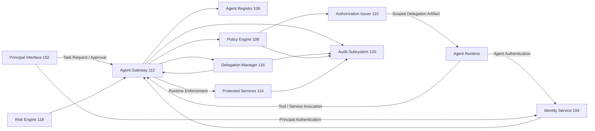

# Fig. 1 — System Architecture for Task-Bound Agent Authorization

## Draft Notes

- Shows the principal, agent runtime, policy controls, issuer, gateway, protected services, and audit path.
- The main invention points are task-bound artifact issuance and runtime enforcement at the gateway.
