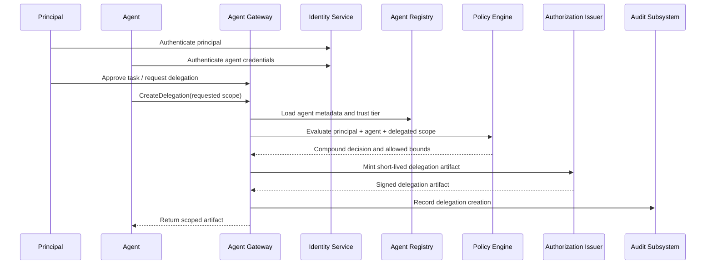

# Fig. 2 — Delegation Issuance Workflow

## Draft Notes

- Emphasizes issuance of a short-lived delegated artifact after compound evaluation.
- Can be converted into a formal sequence figure with numbered callouts.
