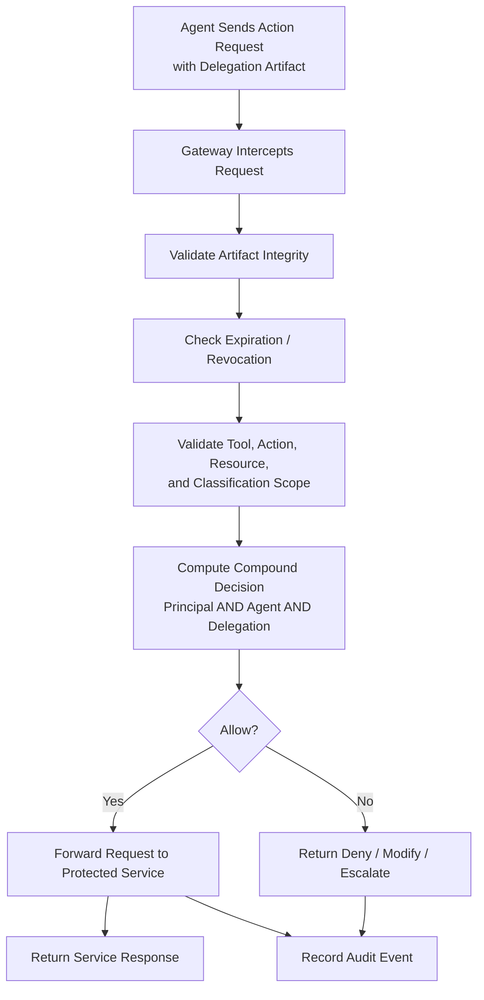

# Fig. 3 — Runtime Action Enforcement Workflow

## Draft Notes

- Focuses on inline mediation before the protected service executes the action.
- Preserves the core technical distinction from static bearer-token validation.
