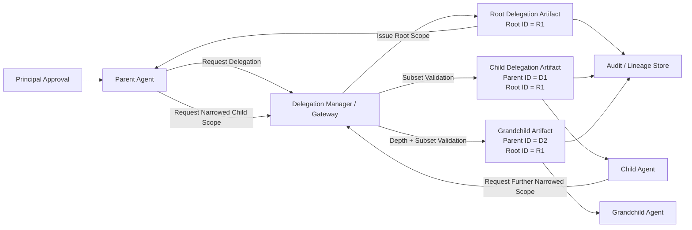

# Fig. 4 — Multi-Agent Delegated Authorization Chain

## Draft Notes

- Illustrates root and parent identifiers, reduced-scope derivation, and chain lineage.
- Formal drawings can add explicit subset labels for tools, actions, and classification caps.
