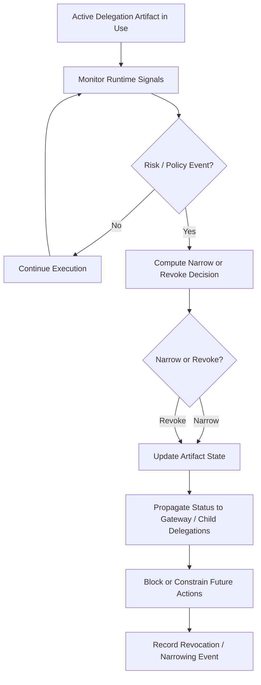

# Fig. 5 — Dynamic Narrowing and Revocation Workflow

## Draft Notes

- Captures dynamic behavior during execution rather than only issuance-time control.
- Works well as the basis for a patent sequence or flow figure.
