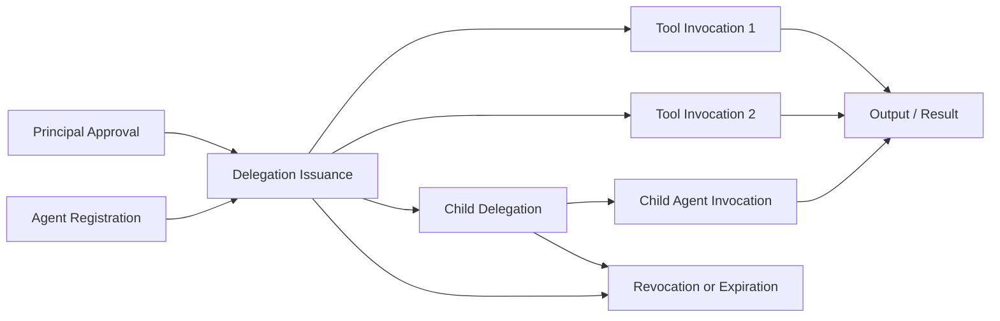

# Fig. 6 — Provenance and Audit Lineage Graph

## Draft Notes

- Shows how approval, delegation, execution, child delegation, outputs, and revocation remain linked.
- Patent drawings can later convert this into a node-link lineage figure with identifiers.
